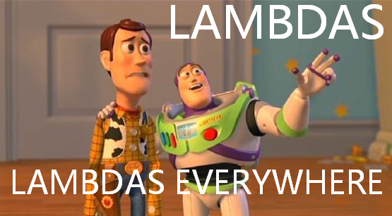

# A functional touch

Post-modern C++ programmers master more than one paradigm and, without a doubt, **functional paradigm** is one.

We cannot really cover functional programming in C++, it would need more than a workshop! However, we could introduce a few interesting concepts and try them out.

## Lambdas, lambdas everywhere



C++11 introduced **lambda expressions** (often called **lambdas**) that are, basically, **nested anonymous functions**:

* nested because you generally create them inside another function,
* anonymous because their type and name is automatically generated by the compiler.

Typically, lambdas are used to encapsulate a few lines of code that are passed to algorithms or asynchronous methods:

```cpp
vector<int> v = {10, 20, 30, 41, 50, 67};
auto firstOdd = std::find(begin(v), end(v), [](int i) { return i%2 == 1; });
```

This expression `[](int i) { return i%2 == 1; }` generates a lambda.

C++ lambdas come with some details to master. I'll show you the most important ones and leave the others to further readings.

### What's a lambda, in short

Basically, a lambda will result in generating a **callable object** (or *functor*, in the C++ slang).

For this lambda:

```cpp
[](int i) { return i%2 == 1; }
```

the compiler could generate something very close to:

```cpp
struct lambda12384950_t
{
    bool operator()(int i) const
    {
        return i%2 == 1;
    }
};
```

Such lambdas are **stateless** and they are automatically convertible to function pointers:

```cpp
using FunPtr = bool(*)(int);

FunPtr ptr = [](int i) { return i%2 == 1; };
```

This kind of lambdas is comparable to creating static strings:

```cpp
int main()
{
    auto someString = "this is a string";
    cout << someString;
}
```

In this case:

```cpp
[](auto i) { return i%2 == 1; }
```

The call operator is templatized:

```cpp
struct lambda12384950_t
{
    template<typename T>
    bool operator()(T i) const
    {
        return i%2 == 1;
    }
};
```

As you will learn in a moment, lambdas can *capture* variables in outer and global scopes, becoming **stateful**:

```cpp
vector<int> prices = {1,2,3};
auto isInPrices = [v](int i) { return find(begin(v), end(v), i) != end(v); };
```

The lambda above may be turned into:

```cpp
struct lambda12384950_t
{
    lambda12384950_t(const vector<int>& field)
        : _private_field_1(field)
    {}

    bool operator()(T i) const
    {
        return find(begin(_private_field_1), end(_private_field_1), i) != end(_private_field_1);
    }
    
private:
    vector<int> _private_field_1;
};
```

Clearly, this kind of lambda cannot be converted to function pointers.

### Parameter list

Just as ordinary functions, a lambda can accept input parameters:

```cpp
auto l = [](int i) { return i%2 == 1; };
```

From C++14 we can leave the compiler deduce parameters automatically (adopting templates deduction rules):

```cpp
auto l = [](auto i) { cout << i << "\n"; };
```

The parameter list is optional when the lambda is parameterless:

```cpp
auto l = [] { cout << "hello" << "\n"; };
```

### Lambda capture

### Return type

### How to hold and pass lambdas around?

- parlare anche di std::function

Continue Reading:

* Up to C++11 but a very good start: [Lambda Functions in C++11 - the Definitive Guide](https://www.cprogramming.com/c++11/c++11-lambda-closures.html)
* [Microsoft on Lambda Expressions in C++](https://docs.microsoft.com/en-us/cpp/cpp/lambda-expressions-in-cpp)
* Arne Mertz: [Part 1](https://arne-mertz.de/2015/10/new-c-features-lambdas/) and [Part 2](https://arne-mertz.de/2015/11/lambdas-part-2-capture-lists-and-stateful-closures/)

## Hands on!

@[Implement a visit function in our service]({"stubs": [ 
	 "microurl/src/ver6/MicroUrlService.h",
	 "microurl/src/ver6/tests/VisitTest.cpp",
	],
	"command": "sh /project/target/run_test.sh ver6 [visit]"})

## Bonus: passing stateful visitors

The functional touch you have added to our service has impressed many developers. One guy implemented a visitor to find the most popular url that our users feed MicroUrl with. Although the logic seems correct, the test he wrote is not passing.

Can you help him?

@[Fix the test]({"stubs": [ 
	 "microurl/src/ver6/MicroUrlService.h",
	 "microurl/src/ver6/tests/StatefulVisitTest.cpp",
	],
	"command": "sh /project/target/run_test.sh ver6 [stateful]"})
	
::: Do you really give up? :(

Range-based for loop combined with structure bindings (what a pity, we cannot express that `id` is unused)...

```cpp
template<typename Action>
void MicroUrlService::VisitMicroUrls(Action action) const
{
	for (auto&[id, url] : m_idToUrl)
		action(url);
}
```
:::